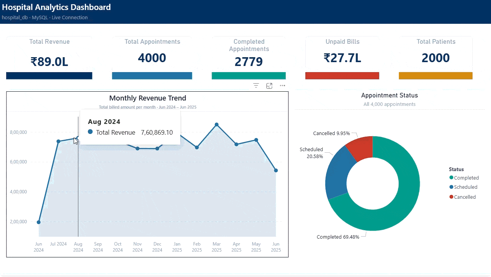
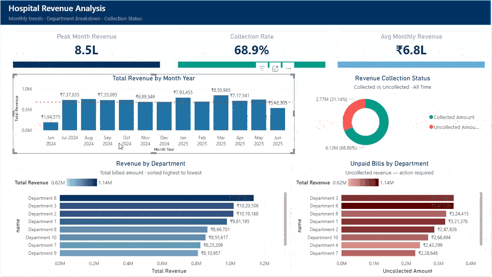
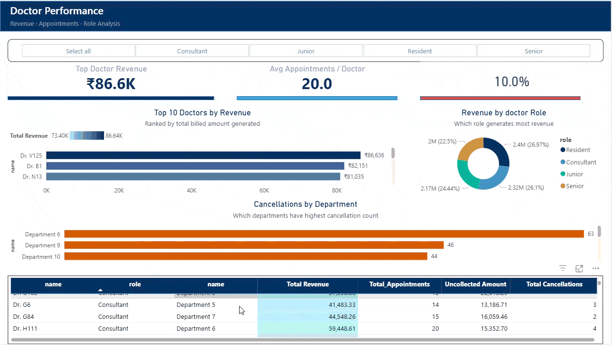

# 🏥 Hospital Analytics — Excel to MySQL Migration & Power BI Dashboard
### MySQL · Python · Power BI · DAX
*An end-to-end data analysis project — migrating 4,000 patient records from a flat Excel file into a normalized MySQL database, with live Power BI reporting.*

---

## 📌 Project Overview

This project works with a hospital dataset of **4,000 patient records** — appointments, 
billing, prescriptions, lab reports, and doctor data — all stored  into a 
**single, unstructured Excel workbook**. No relational structure. No data validation. 
No visibility into ₹27.7 Lakhs in unpaid bills sitting silently uncollected.

This project replaces that flat file with a production-ready data solution:

- ✅ **Normalized MySQL database** (8 tables, 3NF) with constraints, triggers, and stored procedures
- ✅ **Python ETL pipeline** that connects to MySQL and automatically generates a formatted 6-sheet Excel report directly from the database
- ✅ **Live Power BI dashboard** (DirectQuery) with 3 pages covering Revenue, Doctor Performance, and Hospital Overview

---

## 🗄️ Database Design

The flat Excel file was decomposed into **8 normalized tables** following Third Normal Form (3NF). All relationships are enforced through foreign keys, mirroring real-world hospital relationships.

### Tables

| Table | Description |
|---|---|
| `departments` | Hospital departments |
| `doctors` | Doctor profiles with role and specialization |
| `patients` | Patient demographics |
| `appointments` | Core fact table — links patients, doctors, time, and status |
| `bills` | Billing records per appointment |
| `prescriptions` | Medication prescribed per appointment |
| `labreports` | Lab results linked to appointments |
| `doctor_credentials` | Login credentials with FK to doctors |
| `audit_log` | Auto-populated on every appointment INSERT via trigger |


---

## 🐍 Python ETL — MySQL to Excel

The Python script (`SQLhospital_export_script.ipynb`) connects directly to `hospital_db` via `PyMySQL`, runs six multi-table analytical queries, and exports results as a professionally formatted multi-sheet Excel workbook.

### Libraries Used

```
pymysql        — MySQL connection
pandas         — query results to DataFrames
openpyxl       — Excel formatting (headers, colors, column widths)
```

### Queries / Sheets Exported

1. **Monthly Revenue** — total billed amount by month and department
2. **Monthly Trend** — collected vs uncollected amounts over time
3. **Doctor Performance (2025)** — revenue, appointments, paid/unpaid, cancellations per doctor
4. **Unpaid Bills** — uncollected amounts by department with % of total revenue


### How to Run

```bash
# Install dependencies
pip install pymysql pandas openpyxl

# Open in Jupyter or VS Code and update connection credentials:
connection = pymysql.connect(
    host="localhost",
    port=3306,
    user="your_username",
    password="your_password",
    database="hospital_db"
)
```

> ⚠️ **Note:** Update the credentials in the connection cell before running.

---

## 📊 Power BI Dashboard

Connected to MySQL via **DirectQuery** (live data — not a static import). Requires **MySQL Connector/NET** installed separately.

### Page 1 — Hospital Overview



At-a-glance hospital-wide KPIs for management:

- **₹89.0L** Total Revenue
- **4,000** Total Appointments
- **2,779** Completed Appointments (69.48%)
- **₹27.7L** Unpaid Bills — immediately visible and actionable
- **2,000** Total Patients
- Monthly Revenue Trend (Jun 2024 – Jun 2025)
- Appointment Status breakdown (Completed / Scheduled / Cancelled)

---

### Page 2 — Revenue Analysis



Deep financial visibility across departments and time:

- **Peak Month:** ₹8.5L (March 2025)
- **Collection Rate:** 68.9% — meaning 31.1% of revenue is uncollected
- **Avg Monthly Revenue:** ₹6.8L
- Revenue by Department (ranked highest to lowest)
- **Unpaid Bills by Department** — Department 3 leads with the highest uncollected amount, enabling targeted follow-up

---

### Page 3 — Doctor Performance



Individual and role-based performance visibility:

- **Top Doctor Revenue:** ₹86.6K (Dr. V125)
- **Avg Appointments per Doctor:** 20
- Revenue by Doctor Role (Residents lead at 26.97%)
- Cancellations by Department (Department 6: 63 cancellations)
- Full data table: doctor → role → department → revenue → appointments → uncollected → cancellations
- Filter buttons: All / Consultant / Junior / Resident / Senior

---

## 💡 Key Business Insights

The single most valuable outcome of this project is the **visibility it creates around unpaid bills**.

> **₹27.7 Lakhs — 31% of total hospital revenue — was sitting uncollected with no tracking, no visibility, and no way to identify which departments owed the most.**

The dashboard makes this immediately visible and actionable. Department 3 has the highest uncollected amount, followed by Department 6 — enabling the finance team to prioritize collection efforts by department rather than searching blindly.

Other insights surfaced by this pipeline:
- Nearly 10% of all appointments are cancelled — Department 6 has the highest cancellation count (63), pointing to a potential scheduling or capacity issue
- Revenue is remarkably stable month-to-month (₹6.8L average), with a notable dip in June 2024 (the data's first month) and June 2025
- Revenue by doctor role is distributed nearly evenly across all four categories, with Residents and Consultants generating slightly more than Juniors and Seniors

---

## ⚙️ How to Reproduce This Project

**Step 1 — Set up the MySQL database**
```sql
CREATE DATABASE hospital_db;
USE hospital_db;
-- Run: sql/Hospital_DB_Migration_complete.sql
```

**Step 2 — Import source data**

Use MySQL Workbench's Table Import Wizard to import your source CSV into a staging table (`hospital_data`) with all columns set to `TEXT`. Then run the migration script — it handles all type conversions and data cleaning automatically.

**Step 3 — Run the Python ETL**

Open `python/hospital_export.ipynb`, update the connection credentials, and run all cells. The Excel report will be saved to `data/output/hospital_report.xlsx`.

**Step 4 — Open Power BI**

Install [MySQL Connector/NET](https://dev.mysql.com/downloads/connector/net/), open `powerbi/hospital_dashboard.pbip`, and update the data source connection to point to your local `hospital_db` database.

---

## 🛠️ Tech Stack

| Tool | Purpose |
|---|---|
| **MySQL 8** | Relational database, triggers, stored procedures |
| **MySQL Workbench** | Schema design, data import, SQL execution |
| **Python 3** | Python script (PyMySQL, pandas, openpyxl) |
| **Jupyter Notebook / VS Code** | Python development environment |
| **Power BI Desktop** | Interactive dashboard with DirectQuery |
| **DAX** | Calculated measures and KPI labels |

---

## 📄 License

This project is for educational and portfolio purposes.

---

*Hospital Analytics Project · February 2026 · MySQL · Python · Power BI*
